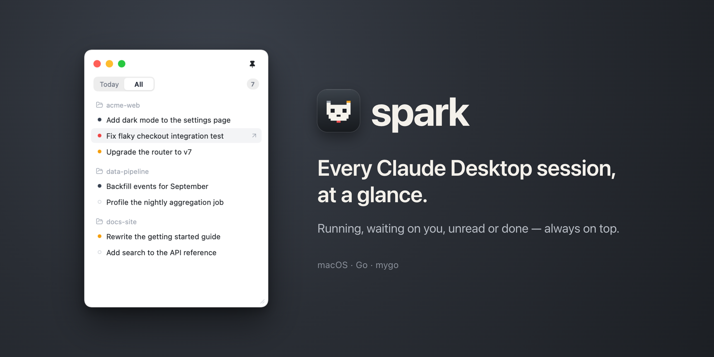

# spark

A small macOS window that shows the live status of every session in the Code tab of Claude Desktop. Built with Go and the native UI of [mygo](https://github.com/egoist/mygo).



## Install

Download the DMG for your Mac from [Releases](https://github.com/zackzhou-work/spark-go/releases): `apple-silicon` for M-series Macs, `intel` for Intel Macs. Open it and drag Spark into Applications.

The app is not signed with a Developer ID or notarized, so the first time you open it macOS says it can't verify the developer. Open **System Settings → Privacy & Security**, scroll down and click **Open Anyway**. Or clear the quarantine flag once:

```bash
xattr -dr com.apple.quarantine /Applications/Spark.app
```

## Where the status comes from

- **Processes**: each core `claude` process carries the desktop session ID in its `CLAUDE_CODE_HOST_SESSION_ID` environment variable. No process means the turn is over.
- **Transcripts**: spark reads the tail of `~/.claude/projects/<cwd>/<cliSessionId>.jsonl`. `end_turn` or a user interrupt ends the turn; a pending tool call means Running; AskUserQuestion or ExitPlanMode means Waiting.
- **Hooks (optional)**: with the hook installed, Claude Code reports permission prompts directly. Without it, spark can only guess them from a tool call that has been pending for 45 seconds with nothing happening.
- **`lastFocusedAt` in the session JSON**: once a turn is over, a `lastActivityAt` newer than `lastFocusedAt` means you haven't looked at the result in the desktop app yet, so it shows as Unread.

Each project gets a character, picked by hashing its name, and the character's face shows the most urgent state among the project's sessions: needs you › working › to read › all caught up. Rows keep an ink-only marker that matches the dot in the desktop app's sidebar:

| spark character | spark row | Desktop sidebar | Meaning |
| --- | --- | --- | --- |
| Raised brows, a bobbing `!` or `?` bubble | Solid dot, on the project's tile | (still a solid dark dot) | Stuck on a permission prompt (`!`) or a question from the model (`?`) |
| Eyes glancing sideways | Spinner | Solid dark dot | The turn is in progress |
| Smiling, with a count badge | Solid dot and a **New** pill | Yellow | The turn is over and you haven't seen the result |
| Eyes closed | Hollow ring | Hollow ring | The turn is over and you've seen it |

The sidebar doesn't mark "waiting for permission" separately. spark adds it because it needs you to act.

Click a project to see all its sessions. A session waiting on you gets a card there: **Respond/Answer in Claude** jumps to it, **Later** puts the card away until the session moves again. Narrower than 340 points, the cards stack into a single column. The window doesn't shrink below 260 points wide.

File watching on the session, transcript and hooks directories drives the scans, and a 5-second timer catches changes that touch no file, such as a process exiting.

## Jumping to a session

Clicking any row, finished sessions included, brings Claude Desktop to the front on that Code session, through its private deep link:

```
claude://code/continue?session=<sessionId>&source=spark
```

`sessionId` is the `local_<uuid>` from the session JSON, so no mapping is needed. Claude Desktop raises and focuses its own window; spark only opens the URL.

**The link has no public contract.** It was read from the routing code in the `app.asar` of Claude.app 2.2553.1 and may change at any time:

- The app validates the ID with `^local_[A-Za-z0-9-]{1,64}$`, and `internal/monitor/deeplink_test.go` pins the same rule. An ID that doesn't match is never sent; spark logs a `[Jump]` line instead, which usually means the format changed.
- Deep links as a whole are gated by a remote flag and by `disableDeepLinks` in `~/Library/Application Support/Claude/config.json`. When they're off, clicks do nothing.
- If `code/continue` stops working, `claude://resume?session=<cliSessionId>` (a bare UUID) is another option. It goes through the "import a CLI session" path and may create a duplicate session, so spark doesn't fall back to it automatically.

**Multiple accounts aren't handled**: spark scans the sessions of every `<account>/<org>`, but the deep link only reaches those of the account signed in now.

## Installing the hook

Copy the script to a fixed location, then merge the settings below into `~/.claude/settings.json`. The script only writes each event to `~/.config/spark/hooks/<session_id>.json` and never affects what Claude Code decides.

```bash
mkdir -p ~/.config/spark && cp hooks/spark-hook.sh ~/.config/spark/spark-hook.sh && chmod +x ~/.config/spark/spark-hook.sh
```

```json
{
  "hooks": {
    "UserPromptSubmit": [{ "hooks": [{ "type": "command", "command": "/Users/<you>/.config/spark/spark-hook.sh", "timeout": 5 }] }],
    "PreToolUse": [{ "hooks": [{ "type": "command", "command": "/Users/<you>/.config/spark/spark-hook.sh", "timeout": 5 }] }],
    "PostToolUse": [{ "hooks": [{ "type": "command", "command": "/Users/<you>/.config/spark/spark-hook.sh", "timeout": 5 }] }],
    "PermissionRequest": [{ "hooks": [{ "type": "command", "command": "/Users/<you>/.config/spark/spark-hook.sh", "timeout": 5 }] }],
    "Notification": [{ "hooks": [{ "type": "command", "command": "/Users/<you>/.config/spark/spark-hook.sh", "timeout": 5 }] }],
    "Stop": [{ "hooks": [{ "type": "command", "command": "/Users/<you>/.config/spark/spark-hook.sh", "timeout": 5 }] }],
    "SessionEnd": [{ "hooks": [{ "type": "command", "command": "/Users/<you>/.config/spark/spark-hook.sh", "timeout": 5 }] }]
  }
}
```

Replace `<you>` with your user name.

## Development

[mise](https://mise.jdx.dev) pins the Go version (`.mise.toml`).

```bash
go run .
```

```bash
go test ./...
```

```bash
SPARK_REAL=1 go test ./internal/monitor -run TestScanRealSessions -v
```

The last one prints the sessions and states spark finds on this machine.

To look at the characters, or render every screen with made-up sessions for comparing against the design:

```bash
go run . -avatars
```

```bash
SPARK_SCREENS=/tmp/spark-screens go test -run TestScreens .
```

The banner at the top of this README is rendered from the app's own view with made-up sessions, then laid out by `docs/banner/index.html` in headless Google Chrome:

```bash
SPARK_BANNER=1 go test -run TestBanner .
```

## Building the app

```bash
go tool mygo build -skip-dmg
```

The app lands in `build/darwin-arm64/Spark.app`, with the bundle ID `dev.spark.app` and the icon from `resources/icon.png`. The window's position and size are kept in `~/Library/Application Support/Spark/window-state.json`.

`LSUIElement` isn't set, so spark is a normal Dock app. To keep it in the menu bar only, add `"macos": {"infoPlist": {"LSUIElement": true}}` to `mygo.json`.

## License

[MIT](LICENSE)
